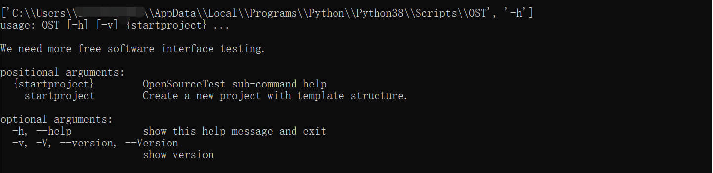

# 安装

OpenSourceTest使用python开发，它支持在Python3.8+版本和大多数操作系统。

## 安装

OpenSourceTest在PyPI官方仓库中，可以通过pip安装

~~~bash
pip install opensourcetest
~~~

如果您想要使用最新版本，可以使用github存储库URL安装。

~~~bash
pip install git+https://github.com/chineseluo/opensourcetest.git@master
~~~

如果您以前安装的OpenSourceTest过老，并且想要升级到最新版本，则可以使用-U选项。

~~~bash
pip install -U opensourcetest
pip install -U git+https://github.com/chineseluo/opensourcetest.git@master
~~~

## 检查安装

安装OpenSourceTest后，系统将添加三个命令。在OpenSourceTest中OST命令等价于Ost、Opensourcetest、opensourcetest，

- 1、OST -V：查看OpenSourceTest版本号（使用时：[-V|-v|--Version|--version"]等价）
- 2、OST -h：查看OpenSourceTest帮助说明（使用时：[-h|-H|--help|--Help]等价）
- 3、OST onlinedocs：查看OpenSourceTest在线文档地址
- 4、OST startproject -h：查看创建项目时的帮助说明（使用时：[-h|-H|--help|--Help]等价）
- 5、OST startproject [project_name]：创建接口自动化项目，[project_name]自定义

检查OpenSourceTest版本：

~~~bash
OST -V
~~~

查看可用选项，请运行：

~~~bash
OST -h
~~~

