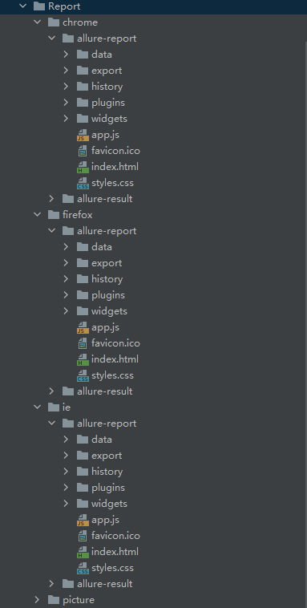

# OpenSourceTest 分布式设置

这一部分介绍OpenSourceTest的分布式设置，便于更方便的进行UI自动化测试。


## 分布式运行测试脚本

### 启动selenium服务

在LocalSeleniumServer模块中，通过命令行执行或者双击执行start_server_windows.bat脚本，可以快速在本地搭建一个本地分布式服务，会启动四个命令行窗口，包含一个hub节点和3个node节点（对应三种浏览器）

### 配置selenium_hub_url地址

在Conf下的config.yaml中，配置selenium_hub_url地址，默认填写的是本地分布式地址，如果是远程分布式需要修改该地址。

### 修改run.py runner

run.py文件中，默认创建项目时，指定的runner为ost_ui_runner，需要修改为ost_ui_cmd_runner

~~~python
# !/user/bin/env python
# -*- coding: utf-8 -*-
import os
from loguru import logger
from opensourcetest.builtin.baseUiRunner import ost_ui_cmd_runner, ost_ui_runner

if __name__ == "__main__":
    browser = ost_ui_runner("chrome", "close", "local")
    url = 'Local Test Report Address:http://127.0.0.1:63342/'+os.getcwd().split("\\")[-1]+f'/Report/{browser.replace(" ", "_")}/allure-report/index.html '
    logger.info(url)
~~~

修改后：

~~~python
# !/user/bin/env python
# -*- coding: utf-8 -*-
import os
from loguru import logger
from opensourcetest.builtin.baseUiRunner import ost_ui_cmd_runner, ost_ui_runner

if __name__ == "__main__":
    browser = ost_ui_cmd_runner()
    url = 'Local Test Report Address:http://127.0.0.1:63342/'+os.getcwd().split("\\")[-1]+f'/Report/{browser.replace(" ", "_")}/allure-report/index.html '
    logger.info(url)
~~~

### 运行start_run_all_browser.bat

双击或cmd运行start_run_all_browser.bat脚本，会启动三个控制台窗口，结束后会生成三个浏览器的报告



### 修改浏览器的运行模式

在LocalSeleniumServer模块下的selenium_run_script目录中存放了三种浏览器的运行脚本以Chrome浏览器举例

~~~ini
cd ..
cd ..
python run.py chrome open local
pause
~~~

只需要修改run.py后的参数即可运行不同的浏览器模式

- 参数一：浏览器，firefox or chrome or ie
- 参数二：是否打开浏览器UI界面，open or close
- 参数三：本地还是远程分布式，local or remote

## docker环境分布式搭建

### docker启动分布式调试方法

#### 1.创建容器

```shell
docker run -p 5555:4444 -d --name hub selenium/hub
docker run -P -d --link hub:hub --name firefox selenium/node-firefox
docker run -P -d --link hub:hub --name chrome selenium/node-chrome
```

#### 2.检查是否启动成功

使用docker环境宿主机的IP+映射的端口进行访问，查看console，查看与hub节点建立连接的node节点的IP和端口等信息是否正确

#### 3.调试模式

server+browser调试模式：使用服务端和node集成在一起的镜像

```shell
docker pull selenium/standalone-chrome-debug
docker pull selenium/standalone-firefox-debug
```

server+node(browser)调试模式，使用hub+node的方式，镜像使用debug级别日志

```shell
docker pull selenium/standalone-chrome-debug
docker pull selenium/standalone-firefox-debug
docker run -d -p 5900:5900 --link hub:hub selenium/node-chrome-debug
```


## 查看Linux下浏览器运行的图形界面

使用vnc viewer，[下载地址](https://www.realvnc.com/en/connect/download/viewer/windows/)

输入docker所在环境的宿主机IP+映射的端口（5900）进行连接，默认密码：secret