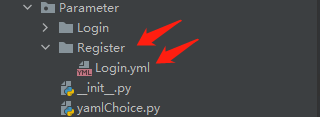

# 编写测试用例

OpenSourceTest v0.2.0通过yaml元素对象注入的方式，整个框架分为三层，Base层、PageObject层、TestCase层，采用传统的互联网的垂直架构模式。

- 元素公共操作方法封装存放在Base层
- 页面元素操作存放在第二层PageObject层，后面如果页面元素变化，直接在第二层相应的Page对象修改即可
- 测试case存放在TestCases层，主要做断言等操作

## yaml编写

在Parameter下Login模块新建一个页面元素yaml文件，Login.yaml，yaml内容如下：

~~~yaml
#封装需要操作的元素对象
description: "登录页面元素操作对象"
parameters:
  - elem_name: "Username"
    desc: "用户输入框名称"
    data: {
      method: "NAME",
      value: "Username"
    }

  - elem_name: "Password"
    desc: "密码输入框名称"
    data: {
      method: "NAME",
      value: "Password"
    }
~~~

yaml格式说明：

   - description：yaml文件说明
   - parameters：参数说明
       - desc：yaml文件说明
       - parameters：参数说明
       - elem_name：元素别名（你调用的时候需要使用）
       - desc：元素描述（例如用户输入框的名称）
       - data：里面是一个字典，元素定位方式，以及元素定位方式的取值

## yaml对象注入

在Parameter模块下的yamlChoice.py文件中进行Login.yaml注册，继承AutoInjection，生成一个yaml文件对象，初始化传递参数规则举例：

- 当文件夹名和模块名一致时（不包括文件的yaml后缀），可以只传递一个参数。传递两个参数时候，第一个参数为文件夹名，第二个为文件名（不包括文件的yaml后缀）

  

  可以采用如下写法：

  ~~~python
  from opensourcetest.builtin.autoParamInjection import AutoInjection
  
  
  # Register yaml file object
  class LoginPageElem(AutoInjection):
      def __init__(self):
          super(LoginPageElem, self).__init__('Login_page', 'Login_page')
  
  
  class BuyPageElem(AutoInjection):
      def __init__(self):
          super(BuyPageElem, self).__init__('Buy_page', 'Buy_page')
  ~~~

- 当你定义的类名和文件夹名和模块名一致时（不包括文件的yaml后缀），可以只传递一个参数。传递两个参数时候，第一个参数为文件夹名，第二个为文件名（不包括文件的yaml后缀）

  例如在yamlChoice.py中新添加一个类，Login，可以使用如下写法：

  ~~~python
  from opensourcetest_test_test.builtin.autoParamInjection import AutoInjection
  
  
  class Login(AutoInjection):
      def __init__(self):
          super(Login, self).__init__(self.__class__.__name__)
  ~~~

- 当你在Parameter文件夹下，新建的文件夹名和其中的文件名（不包括文件的yaml后缀）不一致时，需要传递两个参数，第一个参数为文件夹名，第二个为文件名（不包括文件的yaml后缀）

  

  ~~~python
  from opensourcetest_test_test.builtin.autoParamInjection import AutoInjection
  
  
  class Register(AutoInjection):
      def __init__(self):
          super(Register, self).__init__("Register", "Login")
  ~~~

  

## 封装页面操作对象

在PageObject下Login_page模块创建一个login_page.py封装login页面操作元素，导入Login_page.yaml文件对象，初始化，然后获取yaml文件中封装的元素，底层通过传入locator定位器（元组），进行页面元素操作,示例如下：

~~~python
# !/user/bin/env python
# -*- coding: utf-8 -*-
import importlib
from Base.base import Base
from PageObject.yamlChoice import LoginPageElem

class LoginPage(Base):
    def __init__(self, driver):
        # 初始化页面元素对象，即yaml文件对象
        self.elem_locator = LoginPageElem()
        # 初始化driver
        super().__init__(driver)

    def login_by_config_url(self):
        """
            从配置文件config.yaml获取登录地址
        @return: 登录地址
        """
        return super().login_by_config_url()

    def get_username_attribute_value(self):
        """
            获得账号输入框的placeholder值
        @return: 获得账号输入框的placeholder值
        """
        elem = self.elem_locator.get_elem_locator("Username")
        return super().get_placeholder(elem)
~~~

## 编写测试用例

在TestCases下面新建一个包，例如Login模块，测试登录页面，在Login下面创建一个conftest.py和test_login_page_case.py，conftest.py中指定需要加载的测试页面对象，使用scope级别为function

~~~python
# !/user/bin/env python
# -*- coding: utf-8 -*-
import pytest
from PageObject.loginPage import LoginPage

@pytest.fixture(scope="function")
def login_page_class_load(function_driver):
    """
    注入登录页面对象
    @param function_driver:
    @return:
    """
    login_page = LoginPage(function_driver)
    yield login_page
~~~

test_login_page_case.py中每个测试case需要调用页面模块conftest.py中的function，以及全局配置conftest.py中function_driver（或者function_remote_driver，分布式需要使用该参数)，断言使用Base模块中的assert_method的Assert_method，里面封装了断言方法，包含了allure断言失败截图等操作，根据不同的断言场景取用，或者自己再进行封装

~~~python
# !/user/bin/env python
# -*- coding: utf-8 -*-
import pytest
import allure
import inspect
import logging
from Base.assertMethod import AssertMethod

@allure.feature("Login_page_case")
class TestLoginPageCase:

    @allure.story("Login")
    @allure.severity("normal")
    @allure.description("测试登录")
    @allure.link("https://www.baidu.com", name="连接跳转百度")
    @allure.testcase("https://www.sina.com", name="测试用例位置")
    @allure.title("执行测试用例用于登录模块")
    def test_DLZC1(self, login_page_class_load, function_driver):
        logging.info("Case number code:{}".format(inspect.stack()[0][3]))
        login_page_class_load.login_by_config_url()
        username_input_attribute_value = login_page_class_load.get_username_attribute_value()
        AssertMethod.assert_equal_screen_shot(function_driver, (username_input_attribute_value, "手机号码"))
~~~

## 执行用例

执行用例可以通过两种常用的方法进行

1. pycharm中配置`test runner`为`pytest`，配置路径为`settings->Tools->Python Integrated Tools->Testing`；配置完成后就能够在打开测试用例文件后看到可执行的按钮了

2. 运行在根目录下的`run.py`文件

